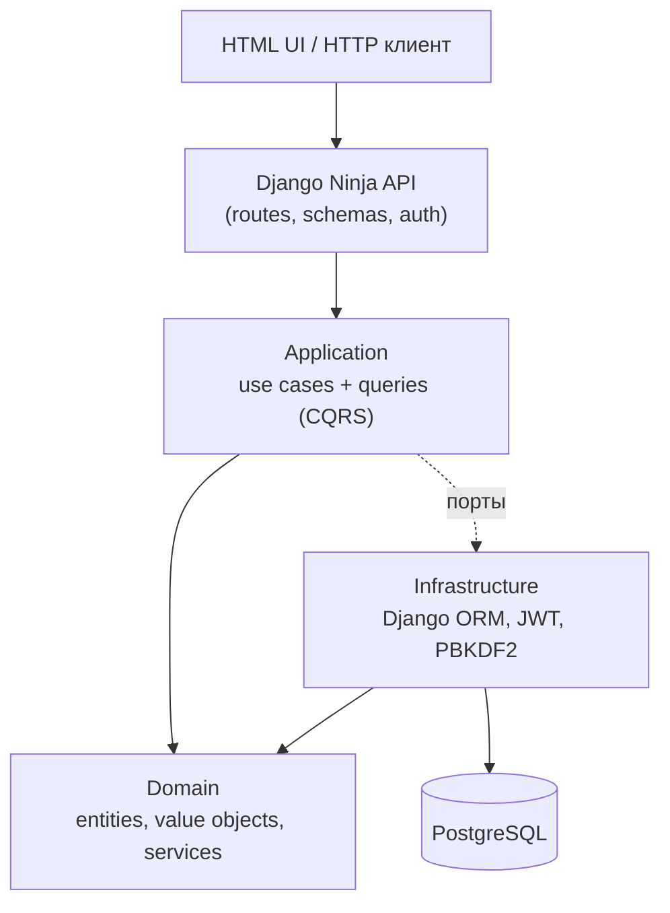

# SimpleBank

банковское API на **async Django + Django Ninja**, построенное по принципам
**чистой архитектуры** (Domain / Application / Infrastructure) и **CQRS**.
Поддерживает регистрацию, JWT-аутентификацию, просмотр баланса и истории операций,
а также переводы между счетами с комиссией — всё поверх PostgreSQL, с тонким
HTML-интерфейсом.

## Возможности

- Регистрация пользователя с автоматическим открытием счёта и приветственным бонусом **€10 000**.
- Аутентификация по email/паролю с выдачей **JWT** (HS256).
- Просмотр баланса и **истории операций** (с фильтрацией по датам, сортировка DESC).
- **Переводы** между счетами: комиссия `max(2.5%, €5)`, атомарная запись DEBIT + CREDIT.
- Тонкий веб-интерфейс (вход, регистрация, кабинет с балансом/историей/переводом).
- **Django Admin** для просмотра пользователей, счетов и проводок (`/admin/`).
- Интерактивная OpenAPI-документация (`/docs`).

## Стек

| Слой | Технологии |
|------|-----------|
| Web / API | Django 5 (ASGI), Django Ninja, Uvicorn |
| БД | PostgreSQL 16, Django ORM (async) |
| DI | dishka |
| Конфигурация | pydantic-settings |
| Аутентификация | JWT (стандартная библиотека), PBKDF2 для паролей |
| Тесты | pytest, pytest-asyncio |
| Упаковка | uv, Docker / Docker Compose |

## Архитектура

Зависимости направлены строго внутрь: `domain` ни от чего не зависит,
`application` зависит только от `domain` (через порты-интерфейсы), а `infrastructure`
реализует эти порты и содержит всё, что связано с фреймворками.



- **Domain** — сущности (`User`, `Account`, `Transaction`), value objects
  (`Email`, `Money`, `AccountNumber`, `PasswordHash`), доменный сервис расчёта
  комиссии, бизнес-исключения. Полностью независим от ORM и фреймворков.
- **Application** — сценарии (`RegisterUser`, `Login`, `TransferMoney`) и
  read-запросы CQRS (`GetBalance`, `ListTransactions`, `ListAccounts`), DTO,
  порт `TransactionManager` (атомарность) и порты репозиториев/сервисов.
- **Infrastructure** — реализации на Django ORM (репозитории, мапперы, read models),
  `DjangoTransactionManager`, JWT/PBKDF2, DI-контейнер, Django Ninja API и HTML-шаблоны.

### Атомарность без Unit of Work

Проект **не использует** явный Unit of Work. Репозитории внедряются в сценарии
напрямую, а атомарность обеспечивает порт `TransactionManager`:

```python
async with transaction_manager.atomic():
    await accounts.update(sender)
    await accounts.update(recipient)
    await transactions.add(debit)
    await transactions.add(credit)
```

Поскольку Django не держит транзакцию открытой между `await`, реализация
`DjangoTransactionManager` буферизует записи (в task-локальном `ContextVar`) и
сбрасывает их одним синхронным `transaction.atomic()` через `sync_to_async`.
Частичные коммиты исключены: при исключении внутри блока ничего не сохраняется.

## Структура проекта

```
src/
├── domain/                         # Ядро: сущности, VO, доменные сервисы, исключения
│   ├── entities/                   # User, Account, Transaction
│   ├── value_objects/              # Email, Money, AccountNumber, PasswordHash
│   ├── services/transfer_fee.py    # Комиссия перевода
│   ├── repositories/               # Порты репозиториев (ABC)
│   └── ports/                      # PasswordHasher, TokenService
├── application/                    # Сценарии и запросы (CQRS), DTO
│   ├── usecases/                   # register_user, login, transfer_money
│   ├── queries/                    # get_balance, list_transactions, list_accounts
│   └── transaction.py              # Порт TransactionManager
└── infrastructure/
    ├── config.py                   # Настройки (pydantic-settings)
    ├── jwt.py / security.py        # JWT, PBKDF2
    └── django/
        ├── settings.py, urls.py, asgi.py
        ├── apps/bank/              # Django ORM модели, admin.py, миграции
        ├── persistence/            # мапперы, репозитории, read models, transaction manager
        ├── di/container.py         # dishka
        ├── api/                    # Ninja: routes, schemas, auth, обработчики ошибок
        └── templates/              # HTML: base, login, register, dashboard
tests/                              # Unit-тесты сценариев (репозитории и TM замоканы)
manage.py, Dockerfile, docker-compose.yml, entrypoint.sh
```

## Быстрый старт (Docker)

```bash
cp .env.example .env      # при необходимости поправьте значения
docker compose up --build
```

- Веб-интерфейс: <http://localhost:8000/>
- Django Admin: <http://localhost:8000/admin/> (логин/пароль из `.env`, по умолчанию `admin` / `admin`)
- OpenAPI-доки: <http://localhost:8000/docs>
- PostgreSQL: `localhost:5432`

Миграции, `collectstatic` и создание суперпользователя админки выполняются
автоматически при старте контейнера. Данные БД хранятся в volume `pgdata`
(полный сброс — `docker compose down -v`).

## Локальный запуск (без Docker)

Требуется Python 3.12+, [uv](https://docs.astral.sh/uv/) и запущенный PostgreSQL.

```bash
uv sync                                   # установить зависимости
cp .env.example .env                      # настроить подключение к БД
uv run python manage.py migrate           # применить миграции
uv run uvicorn infrastructure.django.asgi:application --host 0.0.0.0 --port 8000
```

> `manage.py` сам добавляет `src/` в `PYTHONPATH`. Для запуска uvicorn вне Docker
> выставьте `PYTHONPATH=src`.

Для быстрого локального прогона на SQLite (без Postgres) задайте `SIMPLEBANK_SQLITE=1`.

## Переменные окружения

Настройки читаются из окружения по схеме `SECTION__KEY` (см. `src/infrastructure/config.py`).

| Переменная | По умолчанию | Назначение |
|-----------|--------------|-----------|
| `POSTGRES__HOST` | `localhost` (в Docker: `db`) | Хост БД |
| `POSTGRES__PORT` | `5432` | Порт БД |
| `POSTGRES__USER` / `POSTGRES__PASSWORD` / `POSTGRES__DB` | `simplebank` | Доступ к БД |
| `APP__ENVIRONMENT` | `local` | Имя окружения (влияет на `DEBUG`) |
| `AUTH__SECRET_KEY` | `change-me-in-production` | Секрет для подписи JWT (и Django `SECRET_KEY`) |
| `AUTH__ALGORITHM` | `HS256` | Алгоритм JWT |
| `AUTH__ACCESS_TOKEN_EXPIRE_MINUTES` | `30` | Время жизни токена |
| `DJANGO_SUPERUSER_USERNAME` | `admin` | Логин суперпользователя Django Admin |
| `DJANGO_SUPERUSER_EMAIL` | `admin@example.com` | Email суперпользователя |
| `DJANGO_SUPERUSER_PASSWORD` | `admin` | Пароль суперпользователя (создаётся при старте, если нет) |

> В проде обязательно смените `AUTH__SECRET_KEY` и `DJANGO_SUPERUSER_PASSWORD`.

## API

API смонтирован в корне (`/`). Защищённые эндпойнты требуют заголовок
`Authorization: Bearer <token>`.

| Метод | Путь | Auth | Описание |
|-------|------|:----:|----------|
| `POST` | `/auth/register` | — | Регистрация: создаёт пользователя, счёт и бонус €10 000 |
| `POST` | `/auth/login` | — | Вход, возвращает `access_token` |
| `GET`  | `/accounts` | ✅ | Счета текущего пользователя |
| `GET`  | `/accounts/{account_id}/balance` | ✅ | Баланс счёта |
| `GET`  | `/accounts/{account_id}/transactions` | ✅ | История операций (`date_from`, `date_to`) |
| `POST` | `/accounts/{account_id}/transfers` | ✅ | Перевод на другой счёт |

Пример:

```bash
# Регистрация
curl -X POST http://localhost:8000/auth/register \
  -H 'Content-Type: application/json' \
  -d '{"email":"alice@example.com","password":"s3cret!!"}'

# Логин
TOKEN=$(curl -s -X POST http://localhost:8000/auth/login \
  -H 'Content-Type: application/json' \
  -d '{"email":"alice@example.com","password":"s3cret!!"}' | jq -r .access_token)

# Перевод
curl -X POST http://localhost:8000/accounts/<ACCOUNT_ID>/transfers \
  -H "Authorization: Bearer $TOKEN" -H 'Content-Type: application/json' \
  -d '{"to_account_number":"9234730528","amount":"1000"}'
```

Ошибки маппятся на HTTP-статусы: `409` (email занят), `401` (неверные учётные
данные), `404` (счёт не найден), `400` (нарушение бизнес-правил, например нехватка средств).

## Веб-интерфейс

Server-rendered страницы (Django-шаблоны), которые общаются с тем же API; JWT
хранится в `localStorage`:

- `/` — вход
- `/register` — регистрация (с авто-входом)
- `/dashboard` — кабинет: баланс, история операций, форма перевода

## Django Admin

Встроенная админка Django для поддержки и инспекции данных:

- URL: <http://localhost:8000/admin/>
- Модели: пользователи банка (`UserModel`), счета, транзакции
- Проводки (ledger) — **только чтение** (нельзя добавлять/менять/удалять через админку)
- Хеш пароля пользователя — только чтение
- Правки баланса/пользователя в админке **обходят доменные правила** — это инструмент
  поддержки, не основной способ операций

Статика админки раздаётся через WhiteNoise под ASGI (`collectstatic` в `entrypoint.sh`).
Суперпользователь Django (таблица `auth_user`) создаётся отдельно от банковских
пользователей (`users`) — это два разных аккаунта.

## Тесты

Unit-тесты сценариев с замоканными репозиториями и `TransactionManager`
(без БД и фреймворков):

```bash
uv run --group dev pytest
```

Покрывают: регистрацию, логин, баланс, историю, перевод, расчёт комиссии и
поведение при нехватке средств (в т.ч. отсутствие частичных коммитов).

## Бизнес-правила

- Приветственный бонус при регистрации: **€10 000** (записывается как CREDIT).
- Номер счёта: уникальные 10 цифр.
- Комиссия за перевод: `max(сумма × 2.5%, €5)`; списывается `сумма + комиссия`,
  получателю зачисляется `сумма`.
- Все денежные операции считаются в `Decimal` и округляются до 2 знаков.
